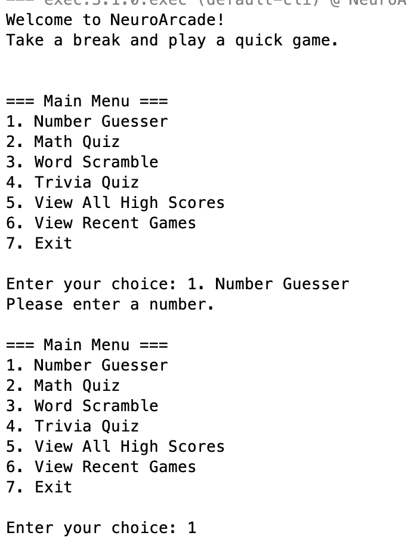
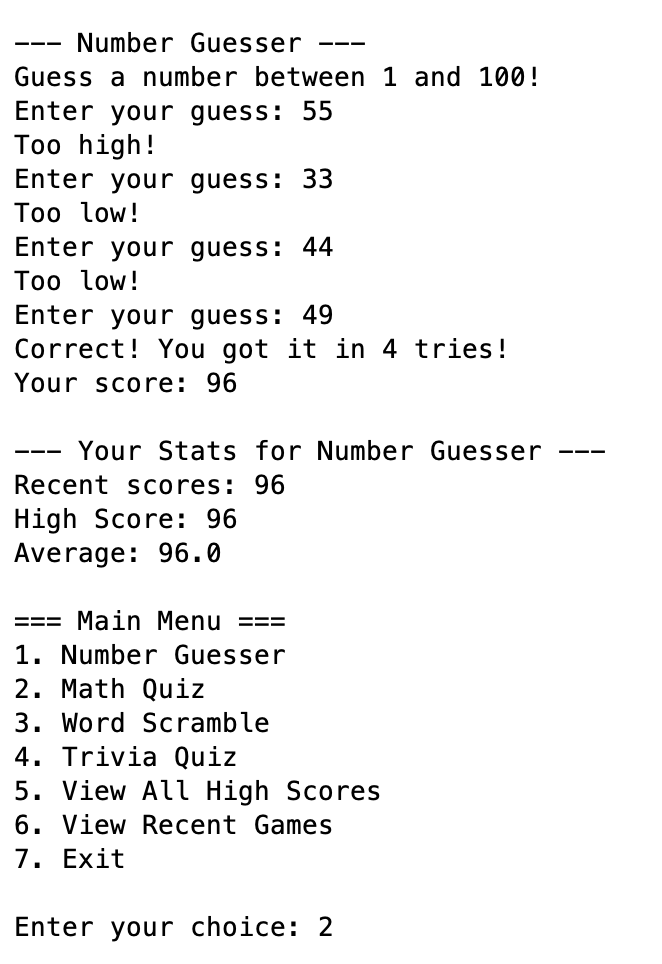
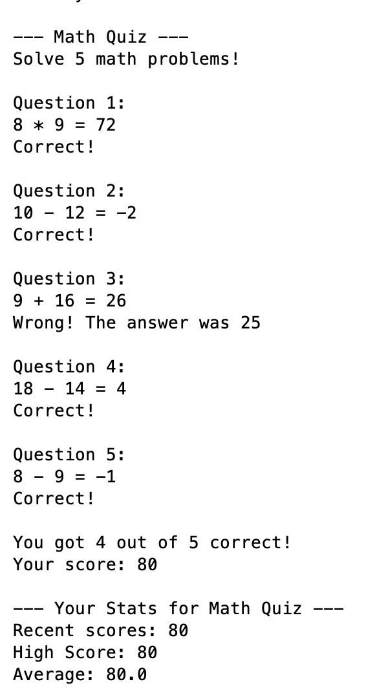
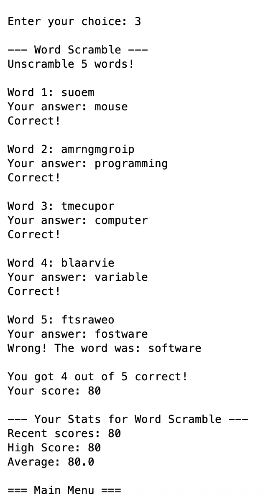
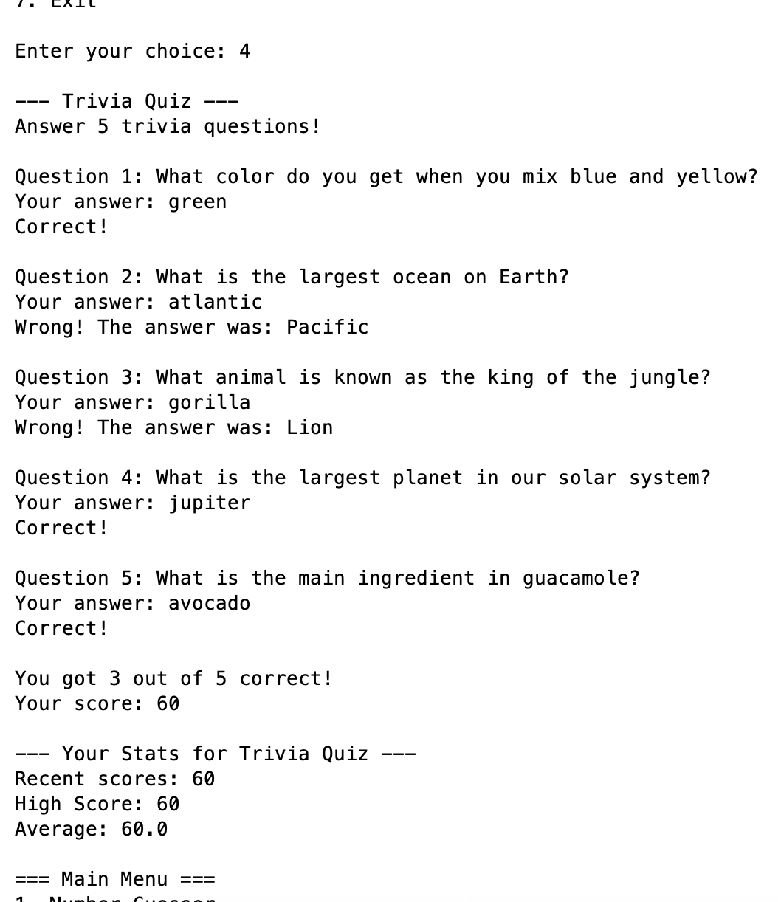
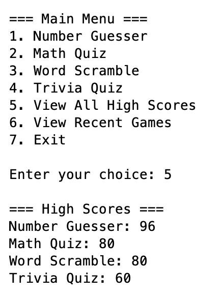

# NeuroArcade

NeuroArcade is a Java console-based arcade application that contains several small mini-games.  
Players can play different games, track their scores, and view statistics for each game.

This project was developed as part of my **Java Programming II course at Roosevelt University**.

---

## Features

- Number Guesser game
- Math Quiz
- Word Scramble
- Trivia Quiz
- Score tracking for each game
- Recent games history
- Hidden admin menu for managing scores

---

## Example Gameplay

### Main Menu


### Number Guesser


### Math Quiz


### Word Scramble


### Trivia Quiz


### Score Tracking


---

## Concepts Demonstrated

This project demonstrates several important programming concepts:

- Object-Oriented Programming (OOP)
- Abstract classes and inheritance
- Data structures (ArrayList, LinkedList)
- File input and output (File I/O)
- Command-line interface design
- Modular program structure

---

## Project Structure

```
neuroarcade-java
│
├── screenshots/
│   ├── main-menu.png
│   ├── number-guesser.png
│   ├── math-quiz.png
│   ├── word-scramble.png
│   ├── trivia-quiz.png
│   └── high-scores.png
│
├── Game.java
├── GameNode.java
├── MathQuiz.java
├── NeuroArcade.java
├── NumberGuesser.java
├── RecentGames.java
├── ScoreTracker.java
├── TriviaQuiz.java
├── WordScramble.java
├── trivia.txt
└── README.md
```

---

## How to Run

1. Clone the repository:

```
git clone https://github.com/Febbu/neuroarcade-java.git
```

2. Navigate to the project folder:

```
cd neuroarcade-java
```

3. Compile the project:

```
javac *.java
```

4. Run the program:

```
java NeuroArcade
```

---

## Author

Pierre Süßmuth  
Computer Science Student  
Roosevelt University
